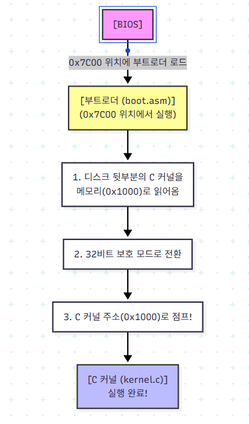

## C 커널과 부트로더 연결하기 이론

flowchart TD
    BIOS["[BIOS]"]
    BL["[부트로더 (boot.asm)] (0x7C00 위치에서 실행)"]
    Step1["1. 디스크 뒷부분의 C 커널을 메모리(0x1000)로 읽어옴"]
    Step2["2. 32비트 보호 모드로 전환"]
    Step3["3. C 커널 주소(0x1000)로 점프!"]
    Kernel["[C 커널 (kernel.c)] 실행 완료!"]

    BIOS -->|0x7C00 위치에 부트로더 로드| BL
    BL --> Step1
    Step1 --> Step2
    Step2 --> Step3
    Step3 --> Kernel

    %% 스타일링
    style BIOS fill:#f9f,stroke:#333,stroke-width:2px
    style Kernel fill:#bbf,stroke:#333,stroke-width:2px
    style BL fill:#ff9,stroke:#333,stroke-width:2px

